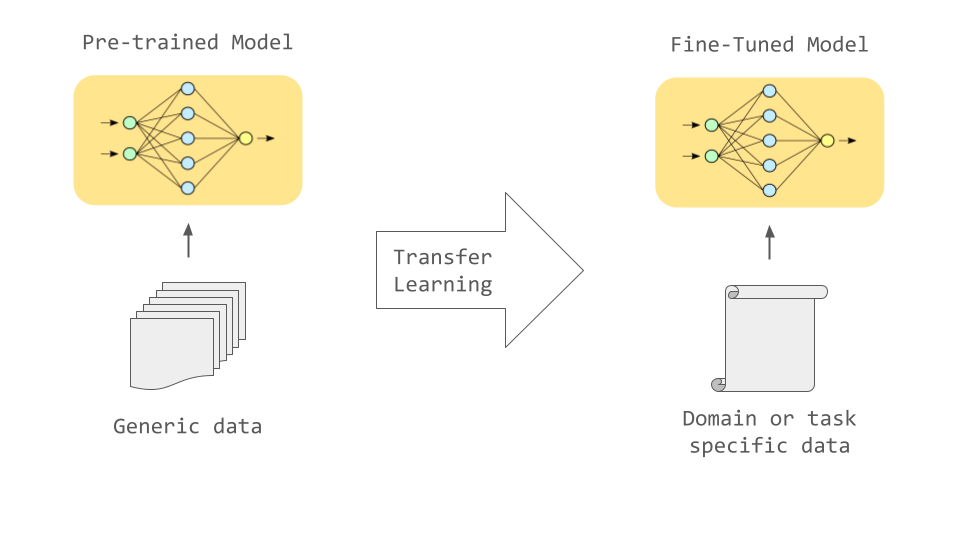
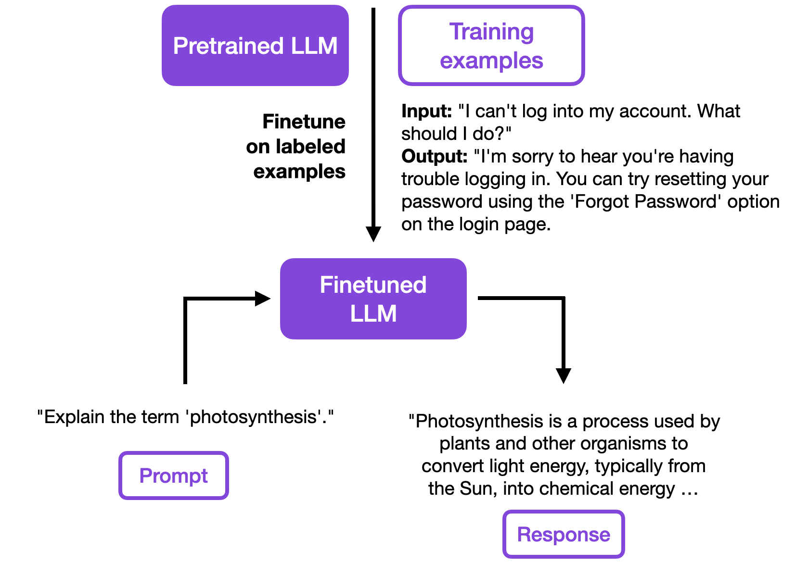

## `llm-templates`


It's a conversation formatter for chat models. The library allows you to easily format a chat conversation, with the same format with which the language model was trained. The library is installed with pip:

```
pip install llm-templates
```

You can quick start with the library using the following [Colab notebook](https://colab.research.google.com/drive/187sA0rGwVLiP6A3IyvV0ICglsJQmvQa3#scrollTo=sUjN9PDx-dcp):

[](https://colab.research.google.com/drive/187sA0rGwVLiP6A3IyvV0ICglsJQmvQa3#scrollTo=sUjN9PDx-dcp)

## Introduction

Many models are based on foundational or pre-trained LLMs, which are then retrained (fin-tuning) with specially designed instruction datasets to improve and refine the abilities of these models on specific tasks:



These data sets typically include a variety of text examples, which can range from questions and answers to instructions and answers. The main purpose is to teach the model how to follow instructions or how to appropriately respond to certain types of requests.

When a language model like GPT-3 or GPT-4 is “fine-tuned” on these data sets, it learns to better understand and perform the tasks presented to it. For example, you may get better at understanding complex instructions, generating more relevant and accurate responses, or adapting to specific communication styles. This is particularly useful for specialized applications, where the model is required to understand and respond appropriately to a specific set of instructions or questions related to a particular field or topic, or for use in dialog systems.

The process of adapting basic LLMs to models trained in following instructions (instruction-following) is called alignment. https://openai.com/research/instruction-following:



Instruction datasets are used for fine-tuning Large Language Models (LLMs). This fine-tuning typically uses supervised learning and includes both an input string and an expected output string. The input and output strings follow a template known as the instruction dataset format (for example, `[INST]` `<<SYS>>`). OpenAI's ChatML and Stanford's Alpaca are examples of Instruction datasets. Below is the instruction data format used by Alpaca for fine-tuning that includes context information (the input field below):

```
Below is an instruction that describes a task, paired with an input that provides 
further context. Write a response that appropriately completes the request.

### Instruction:
{instruction}

### Input:
{input}

### Response:
```

Because the models have been fine-tuned (trained) to generate text in dialogue or query contexts, at the time of inference, we will need to format our prompts in the same way, to not deteriorate the quality of our queries or dialogues.

In conversations or in the request for instructions, messages have a role and content, the latter being the actual text of the message. Commonly, the roles are "user" for messages sent by the user, "assistant" for responses written by the model, and optionally, "system" for high-level directives given at the beginning of the conversation.

If all this seems a bit abstract, here is a chat example to make it more concrete:

```
[
{"role": "user", "content": "Hello!"},
{"role": "assistant", "content": "Nice to meet you!"}
]
```

This sequence of messages needs to be converted into a text string before it can be tokenized and used as input to a model. The problem, however, is that there are many ways to do this conversion. We could, for example, convert the message list into an Instant Messenger format:

```
User: Hello!
Assistant: Nice to meet you!
```

Or we could add special tokens to indicate the roles:

```
[USER] Hello! [/USER]
[ASST] Nice to meet you! [/ASST]
```

Or we could also add tokens to indicate boundaries between messages, but insert the role information as a string:

```
<|im_start|>user
Hello!<|im_end|>
<|im_start|>assistant
Nice to meet you!<|im_end|>
```

There are many ways to do this, and none of them are best or correct. The way depends on how the different models have been trained. The previous examples are not invented; but they are real and used in some popular models. Once a model has been trained with a certain format, we want to ensure that future inputs use the same format, otherwise we can deteriorate the performance of the model.

## Library usage

This is where `llm-templates` comes in. It is a Python package that provides a simple and flexible way to convert a list of messages into a string that can be used as input to a model. It also provides a way to convert the model's output back into a list of messages. The package is designed to be easy to use and to work with a wide range of models and formats. The package is designed to be easy to use and to work with a wide range of models and formats. It is also designed to be flexible and to allow you to customize the conversion process to suit your needs. The package is designed to be easy to use and to work with a wide range of models and formats. It is also designed to be flexible and to allow you to customize the conversion process to suit your needs.

```python
from llm_templates import Formatter, Conversation
messages = [
    {
        "role": "user",
        "content": "Hello!"
    },
    {
        "role": "assistant",
        "content": "How can I help you?"
    },
    {
        "role": "user",
        "content": "Write a poem about the sea"
    }
]

formatter = Formatter()

# Local model
conversation = Conversation(model="zephyr", messages=messages)
print(formatter.render(conversation, add_assistant_prompt=True))

```

And the output using zephyr model template will be:

``` 
<|user|>Hello!</s>
<|assistant|>How can I help you?</s>
<|user|>Write a poem about the sea</s>
<|assistant|></s>
```

Another example using `llama2` model:

```python
formatter = Formatter()

# Local model
conversation = Conversation(model="zephyr", messages=messages)
print(formatter.render(conversation))

```
The output will be:

```
<s>[INST] Hello! [/INST]
How can I help you? </s>
<s>[INST] Write a poem about the sea [/INST]

```

You can also use HuggingFace models:

```python
from llm_templates import Formatter, Conversation
messages = [
    {
        "role": "user",
        "content": "Hello!"
    },
    {
        "role": "assistant",
        "content": "How can I help you?"
    },
    {
        "role": "user",
        "content": "Write a poem about the sea"
    }
]

# Apply HuggingFace Mixtral model template
model = "mistralai/Mixtral-8x7B-Instruct-v0.1"
# model = "HuggingFaceH4/zephyr-7b-beta"
conversation = Conversation(model=model, messages=messages)
conversation_str = formatter.render(conversation)

print(conversation_str)

# And then call the model in HuggingFace via API
from huggingface_hub import InferenceClient
client = InferenceClient()

result = client.text_generation(prompt=conversation_str, model=model, max_new_tokens=768, temperature=0.7, top_p=0.9,
                                top_k=50)

```
And the result will be something like this:

```
The sea, a vast and endless blue,
A world of wonder, forever new.
Its waves crash down with gentle might,
A symphony of nature's sight.

Beneath the surface, secrets lie,
A realm where creatures roam and fly.
Coral castles, home to life,
A world at peace, amidst the strife.

....
```

## References

- [Chat Templates](https://huggingface.co/blog/chat-templates)
- [stanford_alpaca](https://github.com/tatsu-lab/stanford_alpaca#data-release)